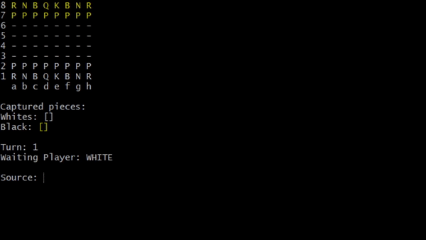

# About
This is a Chess Project from [Mr.Nelio Alves](https://github.com/acenelio) [Java course](https://www.udemy.com/course/java-curso-completo/)
## How to run
The chess games is runned on the Git Bash
```bash
$ java application/Program
```
### How to play
The player must enter the Piece position source(Row and Column) then enter the target position in order to move the piece.


